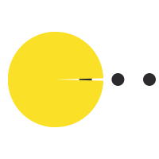

  

  
&nbsp;

#  🙋‍♂️ Hello

### ⛹️‍♂️ About Me

&emsp;&emsp;嗨，我是小边同学。目前是一名大学生，热爱编程、摄影、健身。

&emsp;&emsp;热爱计算机科学、深度学习和计算机视觉，未来希望能成为一名算法工程师。

&emsp;&emsp;<strong>天行健，君子以自强不息；地势坤，君子以厚德载物</strong>

### 💻 Languages and Tools

 
 

 

